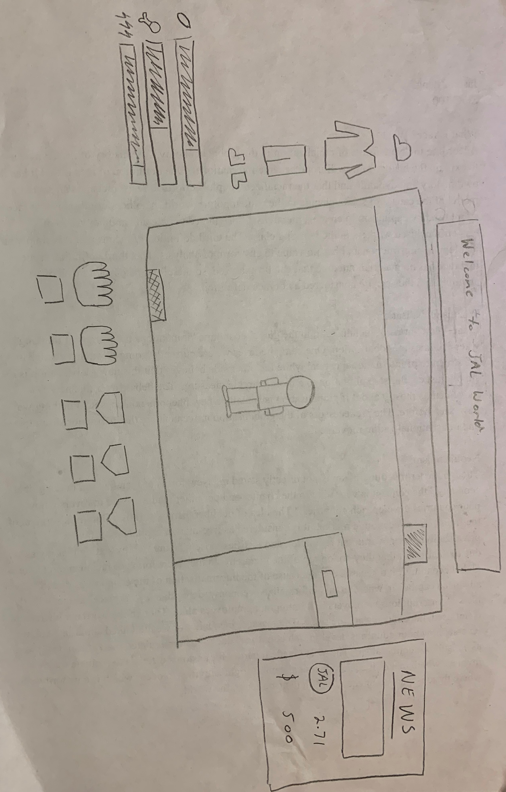
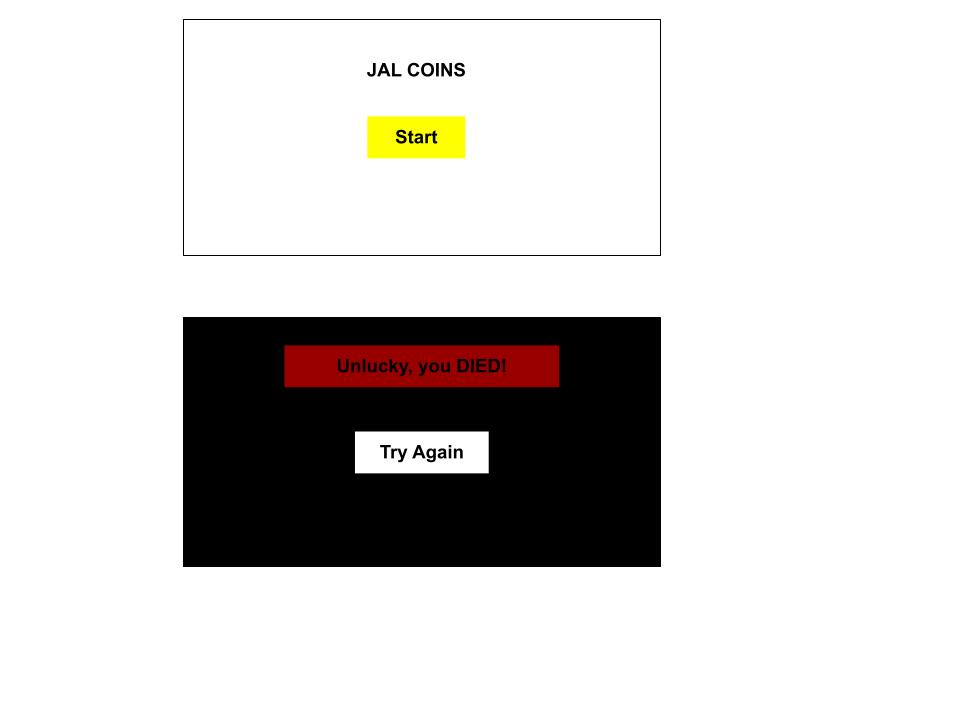

:warning: Everything between << >> needs to be replaced (remove << >> after replacing)
# CS110 Project Proposal
# << Monke Coin Millionaire >>
## CS 110 Final Project
### << Semester, Year >>
### [Assignment Description](https://docs.google.com/document/d/1H4R6yLL7som1lglyXWZ04RvTp_RvRFCCBn6sqv-82ps/edit#)

<< [https://github.com/bucs110b1fall21/final-project-jla-coding<repo>](#) >>

<< https://docs.google.com/presentation/d/1IdEuChcDVK8BtonAIRtgswvMtfufzISVymEA2mJ2Vbo/edit#slide=id.gc4901a2eb_0_6 >>

### Team: << JLA Coding >>
#### Avery vonRoeschlaub, Lukas Ladekarl, Jason Zheng

***

## Project Description *(Software Lead)*
<< A life simulator that has a satirical take on the modern cryptocurrency market as well as the way Gen Z live. There will be two forms of currency, regular USD and a singular cryptocurrency, monke coin. The cryptocurrency will move at a random amount while the USD will stay the same, and the user get to move the cash from one currency to the other. The game will start off in your room with your PC which generates crypto and a little cash. The game will start as a cookie clicker as the player tries to make as much money. The User also has to survive, with there being random events and basic human necessities. We will scale by adding more events and more things on the outside to spend cash on.>>

***    

## User Interface Design *(Front End Specialist)*

The top screen shows and in game text that needs to be said. The right menu shows
the user's dollars and JAL coins with some prescripted news. The bottom menu shows
the food/water inventor; the user can click either hand/pocket to place food/water. The right menu shows the water, food, and tiredness bar and the clothing inventory where the user can decide to put whatever outfit they have that they want to wear. The main game screen starts off in the user's bedroom with their bed that they can sleep in, their computer where they invest in JAL Coins and the small rectangle in the bottom left represents a bed.

Start screen has a start button and the end screen has a try again button, that
is the only buttons the user can click on.

Has a status bar with a interactable computer sink and a background. The player is animated.

Decided not to have a start screen at the end and only have a end screen
* For example, if your program has a start screen, game screen, and game over screen, you should include a wireframe / screenshot / drawing of each one and a short description of the components
* << You should also have a screenshot of each screen for your final GUI >>

***        

## Program Design *(Backend Specialist)*
* Non-Standard libraries
    * << You should have a list of any additional libraries or modules used (pygame, request) beyond non-standard python. >>
    * For each additional module you should include
        * url for the module documentation
        * a short description of the module
* Class Interface Design
    * << A simple drawing that shows the class relationships in your code (see below for an example). >>
        * 
    * This does not need to be overly detailed, but should show how your code fits into the Model/View/Controller paradigm.
* Classes
  * Player - Stores data on player state and variables such as cash and crypto amount. Also allows iteractions to occur when position and direction are correct (note: I forgot direction variable in the vars in the picture)
  * Level - Centralizes data on object positions, walls, etc. Also provides data for each zone/level (perhaps this should be in a seperate file?)
  * Item - pickups and inventory items that can be interacted with. Seperate from interactables as they are not zones and can exist purely in the player's inventroy
  * Interactable - interaction zones and objects that trigger events when interacted with by player
  * Economy - data on crypto -> cash rates and previous rates for grpah rendering 
  * Graphics - GUI and rendering
    * << You should have a list of each of your classes with a description. >>

## Project Structure *(Software Lead)*

The Project is broken down into the following file structure:
* main.py
* src
    * <Icon, button.py, computer.py, controller.py, economy.py, foldercontents.txt, interactable.py, inventory.py, item.py, level_data.json, player.py, prop.py, sample_controller.py, wall.py >
* assets
    * <BurgerIcon.png, CharacterBack.png, CharacterFront.png, CharacterLeftSide.png, CharacterLeftSide1.png, CharacterLeftSide2.png, CharacterRightSide.png, CharacterRightSide1.png, CharacterRightSide2.png, Chickenbag.png, EMPTY ROOM.png, IMG_3287.jpg, RedbullCan.png, WacDonaldsBag.png, WaterIcon.png, WonsterEnergy.png, black_pixel.png, buy.png, cashtocoin.png, characterbackwalking1.png, characterbackwalking1updated.png, characterbackwalking2.png, characterfrontwalking1.png, characterfrontwalking2.png, chart.png, class_diagram.jpg, coin.png, cointocash.png, computer.png, dollar.png, foldercontents.txt, gamescreen.jpg, main_character_back.png, main_character_front.png, main_character_side_moving.png, room1 (2021_11_27 22_00_04 UTC).png, sell.png, sink.png, startend.jpg>
* etc
    * <foldercontents.txt>

***

## Tasks and Responsibilities *(Software Lead)*
* You must outline the team member roles and who was responsible for each class/method, both individual and collaborative.

### Software Lead - <<Lukas Ladekarl>>

<< Worked as integration specialist by keeping up with the progress of both team members. Worked on manty files, but was not the main contributor to most, except with economy.py. Designed and created all sprites. Created worked on ideas and worked with the team on how to implement them. Was the only team member with experience with Crypto, so contributed to making the game accurate. >>

### Front End Specialist - << Jason Zheng >>

<< Front-end lead conducted significant research on... >>

### Back End Specialist - Avery von Roeschlaub

<< The back end specialist... >>

## Testing *(Software Lead)*
* << We tested by announcing our commits to each other and have the other group members look over and check out the commits. >>
    * << On November 25 Avery texts: "Added the level data file and a loading thing for it Also I fixed a movement bug." Both Jason and Lukas pull and check the changes and give positive remarks about the changes. >>

* Your ATP

| Step                  | Procedure     | Expected Results  | Actual Results |
| ----------------------|:-------------:| -----------------:| -------------- |
|  1  | Run Counter Program  | GUI window appears with count = 0  |          |
|  2  | click count button  | display changes to count = 1 |                 |
etc...
