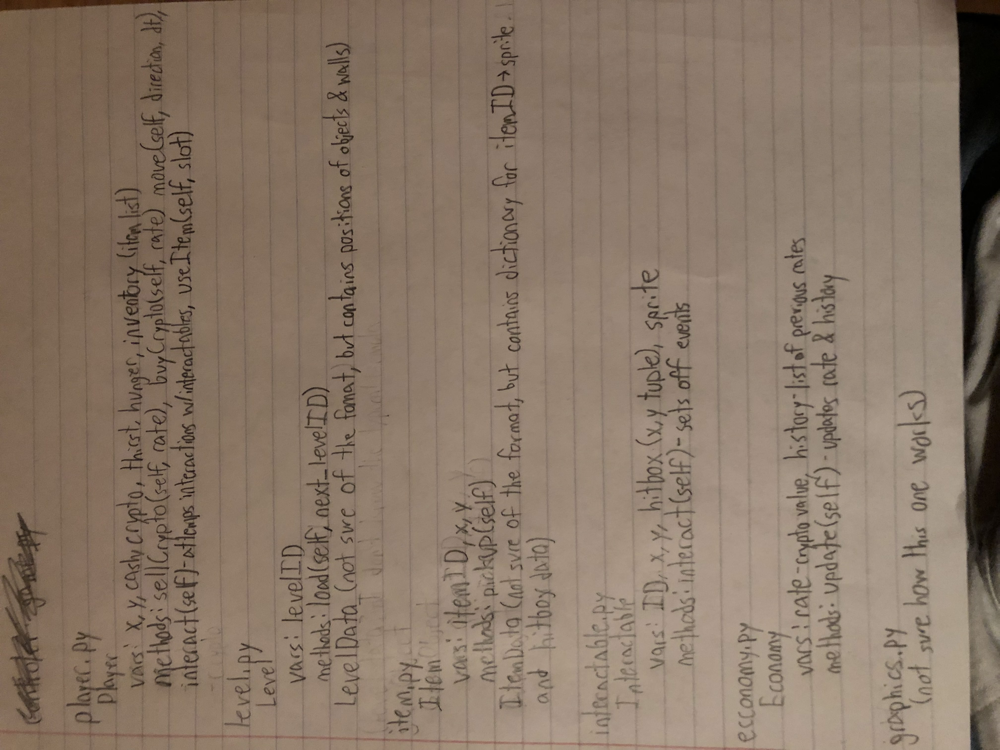

:warning: Everything between << >> needs to be replaced (remove << >> after replacing)
# CS110 Project Proposal
#  Monke Coin Millionaire 
## CS 110 Final Project
###  Fall, 2021 
### [Assignment Description](https://docs.google.com/document/d/1H4R6yLL7som1lglyXWZ04RvTp_RvRFCCBn6sqv-82ps/edit#)

 [https://github.com/bucs110b1fall21/final-project-jla-coding<repo>](#) 

 https://docs.google.com/presentation/d/1IdEuChcDVK8BtonAIRtgswvMtfufzISVymEA2mJ2Vbo/edit#slide=id.gc4901a2eb_0_6 

### Team:  JLA Coding 
#### Avery vonRoeschlaub, Lukas Ladekarl, Jason Zheng

***

## Project Description *(Software Lead)*
 A life simulator that has a satirical take on the modern cryptocurrency market as well as the way Gen Z live. There will be two forms of currency, regular USD and a singular cryptocurrency, monke coin. The cryptocurrency will move at a random amount while the USD will stay the same, and the user get to move the cash from one currency to the other. The game will start off in your room with your PC which generates crypto and a little cash. The game will start as a cookie clicker as the player tries to make as much money. The User also has to survive, with there being random events and basic human necessities. We will scale by adding more events and more things on the outside to spend cash on.

***    

## User Interface Design *(Front End Specialist)*

The top screen shows and in game text that needs to be said. The right menu shows
the user's dollars and JAL coins with some prescripted news. The bottom menu shows
the food/water inventor; the user can click either hand/pocket to place food/water. The right menu shows the water, food, and tiredness bar and the clothing inventory where the user can decide to put whatever outfit they have that they want to wear. The main game screen starts off in the user's bedroom with their bed that they can sleep in, their computer where they invest in JAL Coins and the small rectangle in the bottom left represents a bed.

Start screen has a start button and the end screen has a try again button, that
is the only buttons the user can click on.

Has a status bar with a interactable computer sink and a background. The player is animated.

Decided not to have a start screen at the end and only have a end screen
* For example, if your program has a start screen, game screen, and game over screen, you should include a wireframe / screenshot / drawing of each one and a short description of the components
* << You should also have a screenshot of each screen for your final GUI >>

***        

## Program Design *(Backend Specialist)*
* Non-Standard libraries
  * None used, although one was planned
* Class Interface Design
  * 
* Classes
  * Button - creates a button that has dimentions and text along with selected and deselected colors. Can be w\either selected or unselected
  * ComputerScreen - handles the interactions and display for the computer screen in game, along with managing the buying and selling of crypto
  * Controler - the controler of the game. Runs the game on loop and handles events, level loading, initializations, etc
  * Economy - controls the economy, specifically the rate for crypto to cash. Would also handle stock graphing if it was implemented
  * Interactable - creates interactable objects that trigger events when interacted with along with testing if the player is interacting with it
  * Inventory - handles the inventory and interactions in the inventory
  * InventorySlot - handles individual inventory slots
  * EquipableSlot - unimplemented
  * InventoryItem - superclass of Consumable and Equipable
  * Consumable - creates item that can be consumed - implemented
  * Equipable - creates item that can be equiped by the player - unimplemented
  * Item - unused
  * player - controls the character you control in game. Handles anything involving the player and stats
  * prop - creates an intangable sprite that can be placed anywhere for aesthetics
  * wall - defines an area that the player cannot move into. Also checks for collisions
  
## Project Structure *(Software Lead)*

The Project is broken down into the following file structure:
* main.py
* src
    * Icon, button.py, computer.py, controller.py, economy.py, foldercontents.txt, interactable.py, inventory.py, item.py, level_data.json, player.py, prop.py, sample\_controller.py, wall.py 
* assets
    * BurgerIcon.png, CharacterBack.png, CharacterFront.png, CharacterLeftSide.png, CharacterLeftSide1.png, CharacterLeftSide2.png, CharacterRightSide.png, CharacterRightSide1.png, CharacterRightSide2.png, Chickenbag.png, EMPTY ROOM.png, IMG\_3287.jpg, RedbullCan.png, WacDonaldsBag.png, WaterIcon.png, WonsterEnergy.png, black\_pixel.png, buy.png, cashtocoin.png, characterbackwalking1.png, characterbackwalking1updated.png, characterbackwalking2.png, characterfrontwalking1.png, characterfrontwalking2.png, chart.png, class\_diagram.jpg, coin.png, cointocash.png, computer.png, dollar.png, foldercontents.txt, gamescreen.jpg, main\_character\_back.png, main\_character\_front.png, main\_character\_side\_moving.png, room1 (2021\_11\_27 22\_00\_04 UTC).png, sell.png, sink.png, startend.jpg
* etc
    * foldercontents.txt, Changelog.md

***

## Tasks and Responsibilities *(Software Lead)*
* You must outline the team member roles and who was responsible for each class/method, both individual and collaborative.

### Software Lead - Lukas Ladekarl

 Worked as integration specialist by keeping up with the progress of both team members. Worked on many files, but was not the main contributor to most, except with economy.py. Designed and created all sprites. Created worked on ideas and worked with the team on how to implement them. Was the only team member with experience with Crypto, so contributed to making the game accurate. 

### Front End Specialist -  Jason Zheng

 Front-end lead conducted significant research on implementing a usable inventory system. The inventory was necessary for allowing the user to keep its hunger stat up with consuming food. Also worked on backend parts of the inventory like the "u" removing only and adding food. Also added the actively changing stats on the top left. Implemented most sprites into the game. Worked mainly on player.py and controller.py.

### Back End Specialist - Avery von Roeschlaub

 The back end specialist worked significantly on the interactables. Created the buy menu and all the controls and movement of values that went with it. Made the animations for the character. Created and managed the datafiles that kept the data for sprites and walls. Worked on most files extensively. 

## Testing *(Software Lead)*
*  We tested by announcing our commits to each other and have the other group members look over and check out the commits. 
    *  On November 25 Avery texts: "Added the level data file and a loading thing for it Also I fixed a movement bug." Both Jason and Lukas pull and check the changes and give positive remarks about the changes. 

* Your ATP

| Step                  | Procedure     | Expected Results  | Actual Results |
| ----------------------|:-------------:| -----------------:| -------------- |
|  1  | press movement keys for character sprite (W, A, S, D)  | Character moves  |correct|
|  2  | press E on interactable box | stats change  |correct but bad hitboxes|
|  3  | incorporate hunger and thirst stats | stats change over time  |correct|
|  4  | stats go to 0 | Game End screen  | correct |
|  5  | incorporate cash | stats in dispayed  | correct |
|  2  | press E on interactable box | stats change  |correct |
|  6  | incorporate crypto | stats change randomly in accordance with economy.py |incorrect|
|  7  | press E on computer | opens buy menu  |correct|
|  1  | press movement keys for character sprite (W, A, S, D)  | Character moves with animation |correct|
|  8  | up and down arrow keys  | move percent up and down  |correct|
|  9  | right and left keys | select sell or buy button  | correct |
|  10 | stats go to 0 | Game End screen  | correct |
|  6  | incorporate crypto | rate changes in buy menu |incorrect|
|  11 | pressing v | opens inventory | correct |   
|  12 | pressing enter | confirms purchase  | incorrect |
|  6  | incorporate crypto | rate changes in buy menu |correct|
|  13 | pressing e | closes buy menu | correct |   
|  14 | incorporate number of coins | stat displayed |correct|
|  15 | pressing enter | confirms purchase  | correct |
|  16 | pressing u | buys food  | incorrect |
|  18 | left click over food | removes food and adds to stats  |correct|
|  16 | pressing u | buys food | correct |
   
